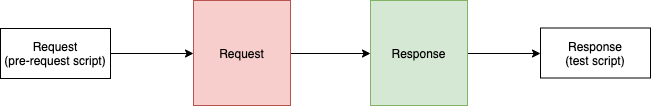
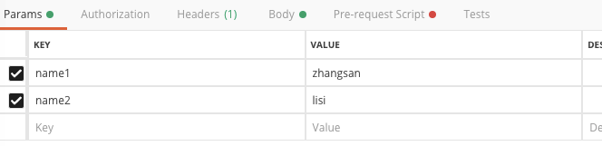
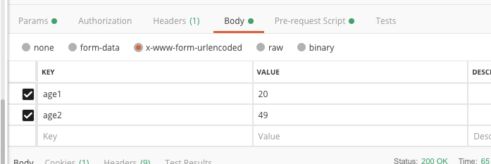
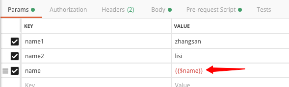

[TOC]

## 脚本执行顺序

在Postman中，单个请求的脚本执行顺序如下：

1. 与请求关联的预请求脚本（Pre-request Script）将在发送请求之前执行
2. 发送请求
3. 发送请求后，将执行与请求关联的测试（test）脚本



## 获取请求参数

### 获取params中的参数




```js
 //获取所有的参数
var $query = pm.request.url.query;
console.log($query.all());
console.log("==========");

console.log($query.toString());
console.log("==========");

console.log($query.get("name1"));
```

输出结果为：

```js
[
	{
		"key": "name1",
		"value": "zhangsan"
	},
	{
		"key": "name2",
		"value": "lisi"
	}
]
==========
name1=zhangsan&name2=lisi
==========
zhangsan
```

### 获取body数据

body数据`content-type`不一样，获取的方法不一样，如下图所示，一般是4种

* `form-data`
* `x-www-form-urlencoded`
* `raw`
* `binary`



我们先以`x-www-form-urlencoded`方式演示一下怎么获取对应的值。

```js
var $body = pm.request.body.urlencoded;

console.log($body.all());
console.log("==========");

console.log($body.toString());
console.log("==========");

console.log($body.get("age1"));
```

输出结果为：

```js
[
	{
		"key": "age1",
		"value": "20"
	},
	{
		"key": "age2",
		"value": "49"
	}
]
==========
age1=20&age2=49
==========
20
```

如果是`form-data`方式的话，只需要将上面的简单修改一下。

```
var $body = pm.request.body.formdata;
console.log($body.all());
console.log("==========");
console.log($body.get("age1"));
```

更多的方法可以查看postman官方文档： http://www.postmanlabs.com/postman-collection/PropertyList.html


## 环境变量

> 变量占位符: {{}}

变量设置的时候我们通过`{{}}`，不仅可以在`params`中，还可以在`body`, `headers`中都可以的。

* `params`
* `body`
* `headers`



```
pm.environment.set("$name", "name11");
```

## 内置模块

参考文档：https://learning.postman.com/docs/postman/scripts/postman-sandbox-api-reference/

* CryptoJS: 加密模块，比如md5, sha256等。
* uuid
* url
* 。。。

## 实战

示例1：比如请求a.com/person/list，请求参数的token需要以一定的规则生成

```
token = md5(appKey+appSecret+毫秒级别的时间)
```

通过postman的pre-request请求中：

```js
var d = new Date();
var $time = d.getTime();

//appKey, appSecret参数中已经设置
var $appKey =  pm.request.url.query.get("appKey");
var $appSecret =  pm.request.url.query.get("appSecret");
var $token = CryptoJS.MD5($appKey+$appSecret+$time).toString();

//设置环境变量
pm.environment.set("$time", $time);
pm.environment.set("$token", $token);
```


